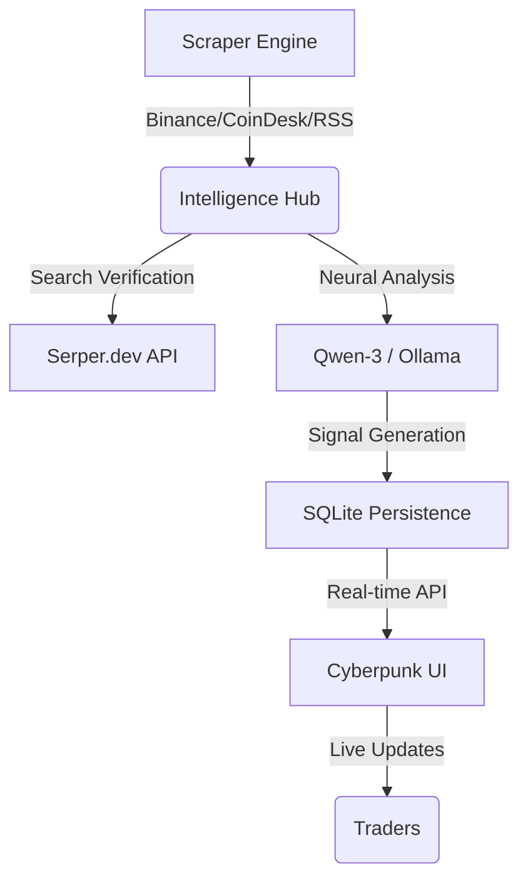

 # ⚡ CYBER-NEWS-ENGINE V3

> **The Ultimate AI-Driven Crypto Intelligence Terminal.**

`cyber-news-engineV3` is a professional-grade cryptocurrency news aggregator and intelligence engine. It scrapes real-time data from global leaders, processes it through advanced Large Language Models (LLMs), and delivers high-confidence trading signals through a stunning, cyberpunk-themed web interface.

---

## 🌌 Project Overview

The mission of this project is to eliminate the "noise" in the crypto market. By combining real-time scrapers with AI-driven context analysis, the terminal provides a direct "Alpha" stream for investors.

### 🏗️ Architecture


---

## ✨ Key Features

| Feature | Description | Status |
| :--- | :--- | :--- |
| **Multisource Scraping** | Live feeds from Binance Announcements, CoinDesk, Decrypt, and more. | ✅ Active |
| **Neural Signals** | AI-generated `STRONG_BUY` / `STRONG_SELL` based on global context. | ✅ Active |
| **Verification Loop** | Every news item is verified via Web Search to prevent "FUD" or fake news. | ✅ Active |
| **Responsive UI** | Premium Cyberpunk design that looks incredible on Ultra-wide monitor or Mobile. | ✅ Active |
| **Deployment Ready** | Full Docker support and GitHub Actions CI/CD pipeline included. | ✅ Active |

---

## 🛠️ Tech Stack

- **Backend**: [Go](https://go.dev/) (Golang) - Scalable, Typed, Fast.
- **Intelligence**: [Ollama](https://ollama.com/) / [Qwen-3-480B](https://modelscope.cn/models/qwen/Qwen2.5-Coder-32B-Instruct) - Reasoning.
- **Database**: [SQLite](https://www.sqlite.org/index.html) - Low latency local persistence.
- **Frontend**: Vanilla JS (ES6+) with Glassmorphism CSS.
- **Infrastructure**: [Docker](https://www.docker.com/) & [GitHub Actions](https://github.com/features/actions).

---

## � Quick Start

### 1️⃣ Clone & Install
```bash
git clone https://github.com/YOUR_USER/cyber-news-engineV3.git
cd cyber-news-engineV3
go mod tidy
```

### 2️⃣ Configure
Rename `.env.example` to `.env` and fill in your keys:
```env
AI_KEYS=your_key_here
SERPER_KEYS=your_serper_key
```

### 3️⃣ Run (Local)
```bash
go run main.go
```
Visit: `http://localhost:8081`

### 🐳 Run (Docker)
```bash
docker build -t cyber-news-V3 .
docker run -p 8081:8081 cyber-news-V3
```

---

## 📱 Mobile Responsive
The terminal is designed with a "Mobile First" approach for the modern trader. 
- **Desktop**: 3-Column Command Center.
- **Mobile**: Single-stack high-priority feed.

---

## ⚖️ License & Security
- **Security**: All secrets are managed via Environment Variables.
- **Warning**: This tool is for **intellectual purposes only**. Always DYOR (Do Your Own Research) before trading.

---
**Developed by Antigravity AI for Marawan.** 🌟
